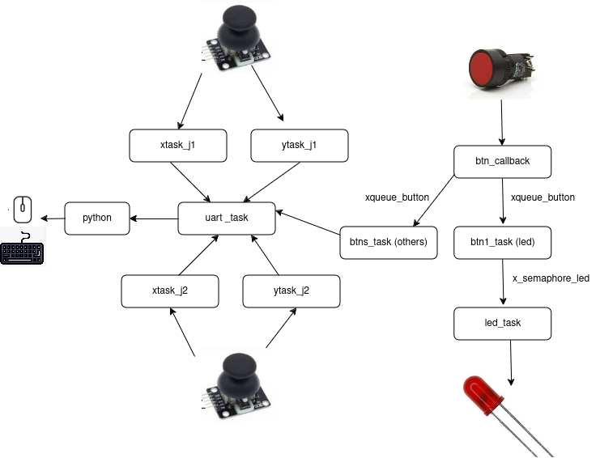

# HC-05 Exemplo

Manual: [https://www.olimex.com/Products/Components/RF/BLUETOOTH-SERIAL-hc-05/resources/hc05.pdf](https://s3-sa-east-1.amazonaws.com/robocore-lojavirtual/709/HC-05_ATCommandSet.pdf)

Conectar HC-05 no 5V e gnd, pino TX no `GP5` e pino RX no `GP4`. Também é necessário conectar o pino `STATE` do bluetooth no pino `GP3`.

O projeto está organizado da seguinte maneira:

- `hc05.h`: Arquivo de headfile com configurações do hc05, tais como pinos e uart.
- `hc05.c`: Arquivo `.c` com implementação das funções auxiliares para configurar o módulo bluetooth:
    - `bool hc05_check_connection();`
    - `bool hc05_set_name(char name[]);`
    - `bool hc05_set_pin(char pin[]);`
    - `bool hc05_set_at_mode(int on);`
    - `bool hc05_init(char name[], char pin[]);`

- `main.c` Arquivo principal com inicialização do módulo bluetooth.

```c
void hc05_task(void *p) {
    uart_init(hc05_UART_ID, hc05_BAUD_RATE);
    gpio_set_function(hc05_TX_PIN, GPIO_FUNC_UART);
    gpio_set_function(hc05_RX_PIN, GPIO_FUNC_UART);
    hc05_init("aps2_legal", "1234");

    while (true) {
        uart_puts(hc05_UART_ID, "OLAAA ");
        vTaskDelay(pdMS_TO_TICKS(100));
    }
}
```

Extra ao que foi feito em sala de aula, eu adicionei o `hc05_set_at_mode` que força o módulo bluetooth entrar em modo `AT`, caso contrário ele fica 
conectado no equipamento e não recebe mais comandos.

## No Linux

Para conectar o bluetooth no linux, usar os passos descritos no site:

- https://marcqueiroz.wordpress.com/aventuras-com-arduino/configurando-hc-06-bluetooth-module-device-no-ubuntu-12-04/

JOGO:
ShellShock.io

Inputs e Outputs:
- 5 botoẽs (inputs)
- 1 led (output)
- 2 joysticks (inputs)
- sensor imu (input)

Diagrama de blocos:
ytask1(joystick1)
xtask1(joystick1)
ytask2(joystick2)
xtask2(joystick2)
uart_task
led_task(controle ligado)
btn1_task(switch button)
btn2_task
btn3_task
btn4_task
btn5_task
x_semaphore_led
xQueuBut1
xQueuBut2
xQueuBut3
xQueuBut4
xQueuBut5
xQueueJoystick1
xQueueJoystick2
btn1_callback
btn2_callback
btn3_callback
btn4_callback
btn5_callback




